# Overview

This VeriStand add-on is used to communicate with instrumentation (power supplies, power analyzers, environmental chambers, fuel meters, emissions equipment, etc) over various protocols. 
It supports serial, GPIB (using NI VISA), ethernet (TCP, UDP, NI VISA), AK serial, and AK TCP.  
Users define the communication specifics (commands, responses, etc) within the add-on. This allows a single add-on to be used for a wide range of instruments.

 
 

# Repo location

[Github](https://github.com/ni/niveristand-instrument-addon-custom-device )

---
 

# Requirements

These drivers must be installed on the deployment computer/target to function:

- NI VeriStand 2018 or later
- NI VISA 18.0 or later
- NI Serial 18.0 or later​​
---
 

# Add-on Specifics
## Add-on Configuration

Upon adding the Instrument Addon, a configuration GUI will open. Select the desired Protocol. Optionally, a previously exported configuration can be imported.

Then, configure the​​ protocol settings on the main page. The search button (magnifier glass icon) will detect the available ports or interfaces on the current Target/Controller. 
Also, notice the built-in help. 
This help provides the details needed to use each section.​

After these settings are entered, an initial test of the configuration is recommended. 
Deploy the system definition, check that simple messages like *IDN? can be sent to the instrument without errors using the Instrument Addon Tool (discussed below).   
If this test is not successful, make sure the instrument is powered, wired, and remote communication is enabled/supported. 
If that doesn't work, try different termination characters, port settings, etc. Keep referencing the instrument's documentation and confirming settings. 
Also, if there is a LabVIEW API available for the instrument on ni.com/idnet, download and review it in LabVIEW (if possible). If the test is successful, continue setting up the add-on.  
Start adding Messages. To do this, first add a Message Group. This group is simply an organizational container. Then, add a Message to the Message Group. 

A Message contains a configurable Command and Response. It also contains five channels for execution and status. The Trigger channel executes the Message.  
The Message Status reports if the Messages has finished execution but does not indicate success. The Error Code channel indicates if there was an error in the execution and does indicate success.  
The Timestamp channel returns the last execution time. If the Message is configured as Periodic & Trigger, the Enable Periodic channel starts and stops generation of the Message. Otherwise, it is ignored. 
Next, configure the Message. Decide if the Message is an event or periodic. If it is periodic, set the generation period. 

This add-on is designed to run in the 10s of Hz. It may be possible to request messages at faster rates, but it is not recommended.  
If possible, stay around 1 to 10 Hz. Especially if using multiple periodic messages.  
Generating Messages based on the value change of channels within the Message is supported (as shown above). This is useful with a Command like VSET:[Level].  
Every time Level is updated, the Message will be automatically sent. However, this generation type can cause issues when not used properly.  
As an example, VSET[Channel]:[Level]. In this case, the Message would be sent when either Channel or Level was changed. 
In reality, it should only generate when both Channel and Level are updated. Otherwise, the wrong channel could be set to the wrong level. In this case, use the Trigger generation type.  
​The Message can also automatically include a protection value (checksum or CRC) at the end of the Message. 

After setting the Message Generation Type and Protection settings, decide if the Message is a Command Only (write) or a query (write then read).  
If you are defining a write only, delete Response. If you are doing a query, leave both. 
Next, go to Command Settings and configure the Command. Do this by entering the Command string. 
Enter a static Command (VSET1:10.000) or parameterize the string with variables using the Add Channel or Add Array buttons.  
As an example, the configuration below is VSET[Channel]:[Level], where [Channel] and [Level] are variables linked to VeriStand channels 

​Notice the Command supports different viewing formats, like Hex.

Also notice that a Message can have a fixed message length.

For a Command, a global variable or Command specific variable can be used for parameterization. These variables are called MetaData. 
Define the format of this channel by selecting it. Below is a numeric to human readable string (Format) conversion.

The Enumerated List will convert the VeriStand channel value to the configured string (ie 0 = OFF; 1 = ON).

Then, define the Response if one is expected. This works in the same way as the Command.  
Enter the Response string format and parameterize it as needed.

Make sure to set the Wait Type. If choosing a Wait sec, be careful that everything can logically execute.  
As an example, if the Message's periodic rate is set to 10 ms, but a wait time of the Response is set to 20 ms, overflows or lost data will occur. 
​Again, similar to Command variables, Response variables can be configured.

Notice that arrays are supported. 
Once everything is configured, export the configuration. This makes it so the Messages are defined once and can then be easily re-used in any other configurations.​

---

## Add-on Execution

Deploy the system definition. From within the user interface, drag and drop Messages as sections.

Change required channels to controls, such as Trigger, Enable Periodic and anything under Command. Delete any empty containers.

Use the Message Channels to execute and control the Messages. 
Use Trigger to force a Message to be executed​. 
Use Enable Periodic to stop and start the periodically generated Messages.  
As an example, to send a Message with the command OUT[CH]:[ENABLE], write the desired values to CH and ENABLE, then set Trigger to 1. 
Certain channels can be added as Rings to show text. A metadata channel of type enum supports this.

So do Error Code channels.​

Use Message Status and Error Code to sequence through a series of Messages.  
For example, trigger a Message and wait for Message Status to be true. This means that the Message was executed. 
Then check Error Code. If Error Code is 0, the Message was successfully sent. 
Then go on to trigger the next Message.​ Timestamp can be used in a similar fashion. 
Trigger a Message, wait for Timestamp to change, check Error Code.

## Add-on Tool

​The add-on also comes with a host tool that provides additional features. These features help in manual testing and debugging. Add this tool to the project files:

It can also be added as a button to the UI screen.

Click open on the file or select the configured button to launch the tool.​

Select File >> Configure and select the desired add-on.​

​Then, put in any string Command to send, configure the Response criteria, and send the raw message. 
The Response string will be returned in the Response field.  
Note: this goes around all the VeriStand channels. They will not update as part of this. 
This provides a place to test and debug the instrument for things like basic connection, termination characters, message format​, etc.

## Host Automation API

In addition to the above items, there is an automation API that can be used from Windows to initiate commands with the add-on. This is installed at: 
C:\Users\Public\Documents\National Instruments\NI VeriStand <Year>\Custom Devices\Instrument Addon\Windows\Host Automation API  
An example of using this API is as follows:

First, connect to the add-on by its name and expected target IP address. Then send raw messages. When finished, close the connection.

## System Definition API

There is also a system definition API that allows the user to programatically create an instance of the add-on from a previously exported configuration. 
This is installed at: 
C:\Users\Public\Documents\National Instruments\NI VeriStand <Year>\Custom Devices\Instrument Addon\Windows\System Definition API  
An example of using this API is as follows:​​​

## Scripting API

Users can add flexibility and reusability to their systems by creating and configuring system definitions through the Scripting API.

## With this API, users can: 
- create a new Instrument from a previously exported configuration  
    Node used: **Create Instrument Addon From Configuration File** 
 

- create a new Instrument from scratch  
    Node used: **Create Instrument Addon** 
 

- add Messages, Command/Response sections and configure them  
    Node used: **Create Message Group** 
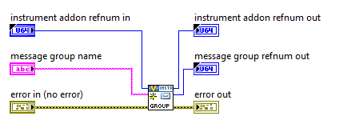

    Node used: **Create Command** 
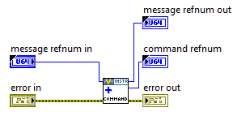

    Node used: **Configure Command** 
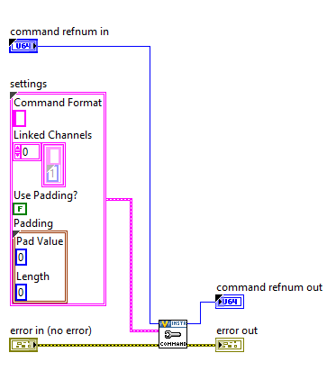

    Node used: **Create Response** 
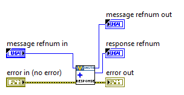

    Node used: **Configure Response** 

    Node used: **Create Message** 

- Create Channels  
    Node used: **Create Global MetaData Channel** 
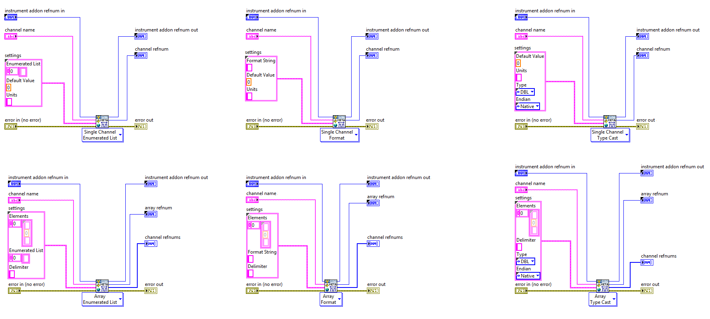

    Node used: **Create MetaData Channel**    

    Node used: **Create Data Channel** 
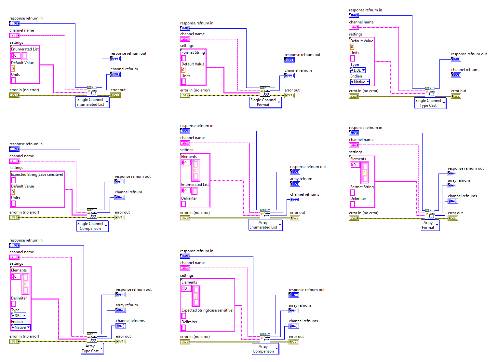

- Fetch the Protocol object for a specific Instrument Addon and change it  
    Node used: **Get Protocol** and **Set Protocol** 

- Get and Set the PCL Decimation  
    Node used: **Get PCL Decimation** and **Set PCL Decimation** 
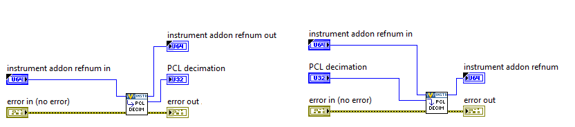

- Get information regarding the type of a protocol  
    Node used: **Get Protocol Type** 

- Create and configure a protocol  
    Node used: **Protocol Factory** 
 
     
A Protocol object is needed as input when creating a new Instrument Addon 
List of supported protocols: 
   - RS-xxx
   - RS-xxx to ConvBox
   - VISA
   - TCP
   - UDP
   - AK RS-xxx
   - AK TCP 

## Example Usage for Scripting API

This is a basic example of configuring an Instrument Addon with a single message, with both Command and Response, and then exporting the configuration to a file on disk.

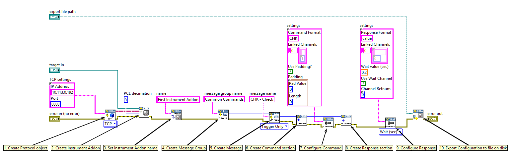

Another scenario would be when loading an existing configuration and altering all or part of the Instrument Addon's Protocol properties. 
### Example 1: 
This example covers a scenario where the user wants to alter the IP Address of a protocol (either TCP or AK TCP) and leave other properties unchanged. 

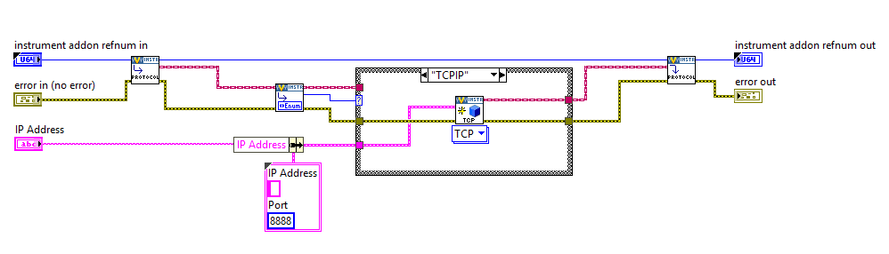

Below is the logic in the AK TCP case: 
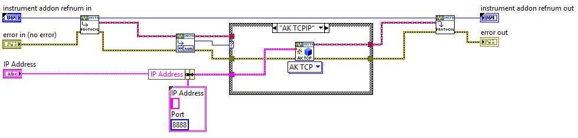

### Example 2: 
Set a new Protocol, regardless of the previous configuration 

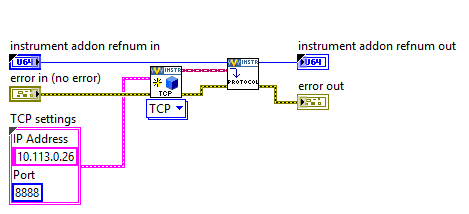

### Example 3: 
This example uses a configuration file (exported in the Basic Example) to create an Instrument Addon Custom Device with the same configuration,
adds a Global MetaData Channel, another Message, a Command Section and a MetaData Channel. 
It configures the Command to use the MetaData Channel and the Global MetaData Channel by assigning their refnums to two variable names (thus creating two linked channels). 

### Example 4: 
This example uses a prevous configuration (from Example 3), creates the Instrument Addon based on it, 
 adds another message with Response and creates a Data Channel for it 

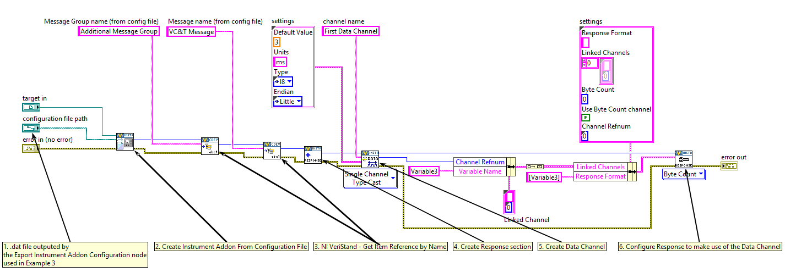

